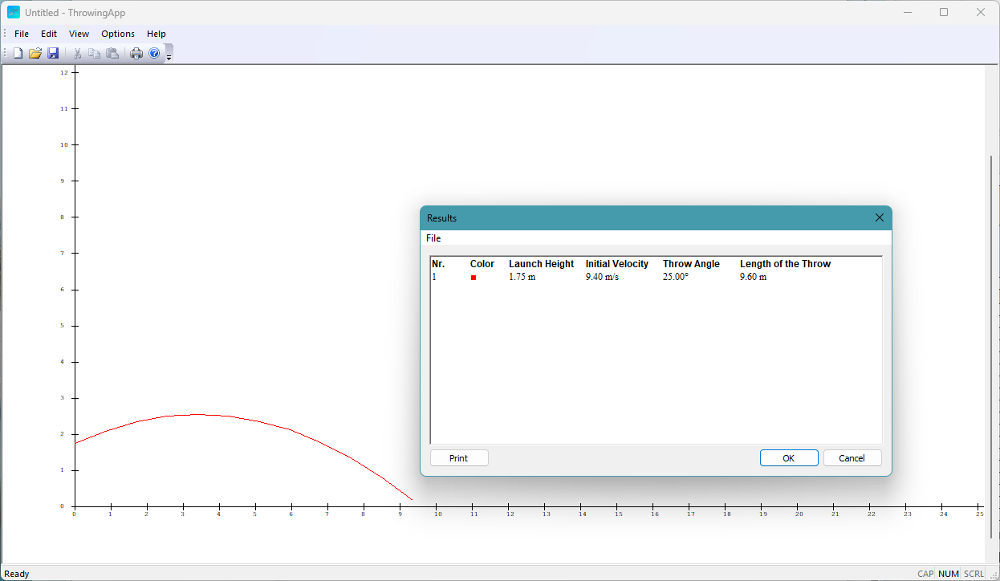

# ThrowingApp

A Windows MFC application for simulating and visualizing throwing trajectories (e.g. shot put). The app plots the flight path of a throw based on launch height, initial velocity, and throw angle, and displays the calculated length of the throw in a results dialog.

## Screenshot

